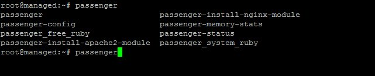

# Make sure you have finished this steps, before deploy django with passenger and nginx.

# Step - step :

- Install Nginx with Passenger as usual  : 
([https://www.phusionpassenger.com/library/install/nginx/install/oss/](https://www.phusionpassenger.com/library/install/nginx/install/oss/))
- I choose Ubuntu 14.04
([https://www.phusionpassenger.com/library/install/nginx/install/oss/trusty/](https://www.phusionpassenger.com/library/install/nginx/install/oss/trusty/))
- After installation completed, you may check your passenger with type # passenger

- create virtualhost of your domain, example : ([url](https://github.com/ariq01/django-passenger-nginx/blob/master/nginx/sites-available/djangodemo.riqnaufal.com))
- # ln -s /etc/nginx/sites-available/yourvirtualhost.com /etc/nginx/sites-enabled/yourvirtualhost.com
- # service nginx reload
- # service nginx restart
